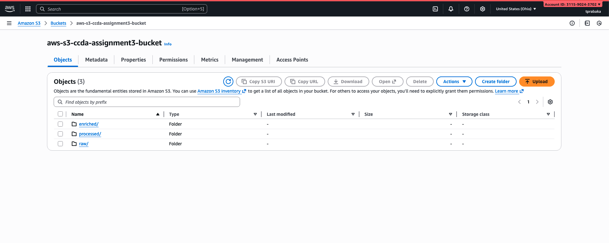
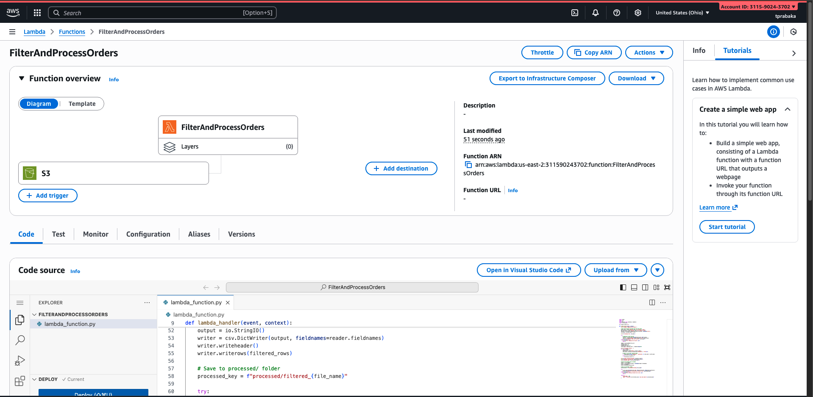
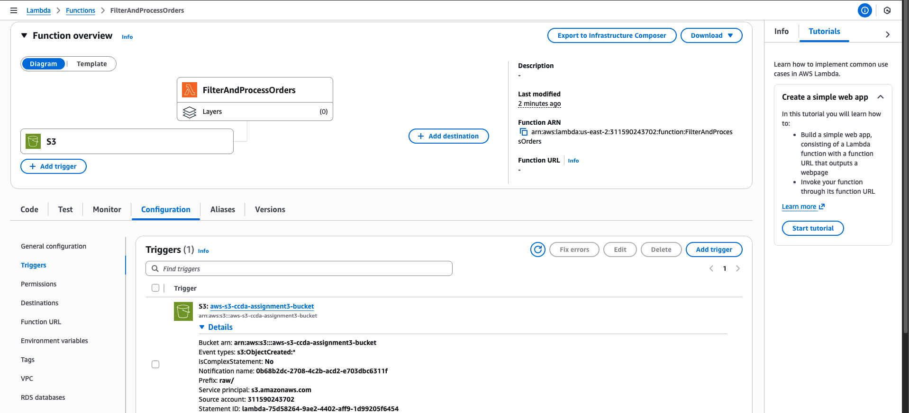
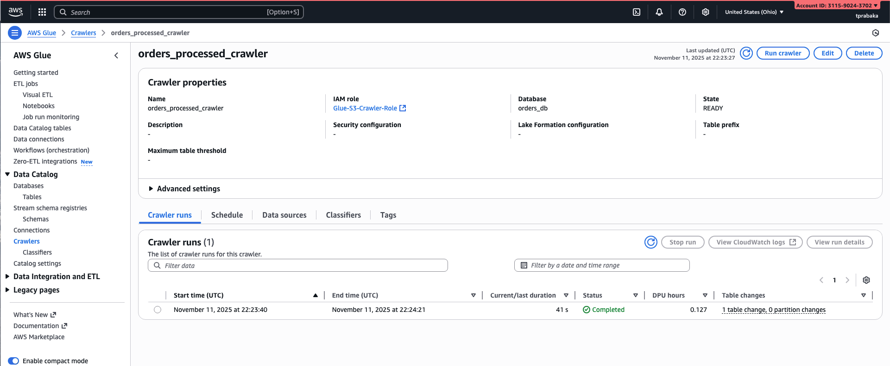
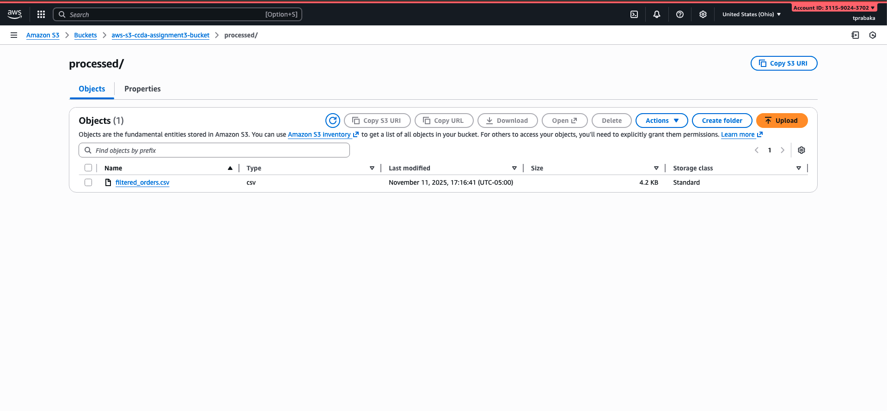
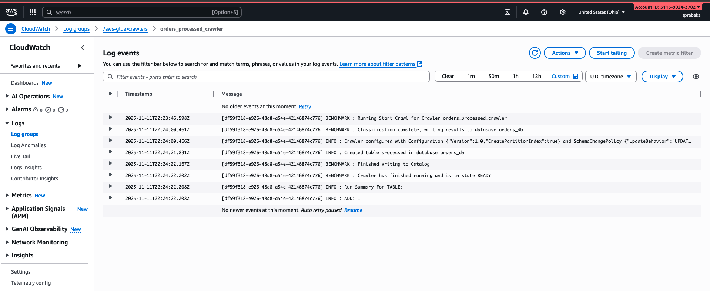
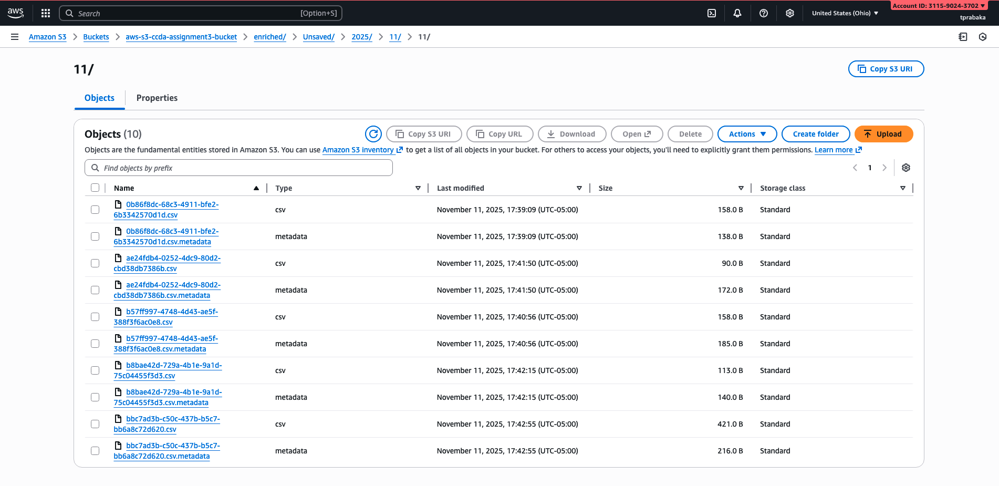
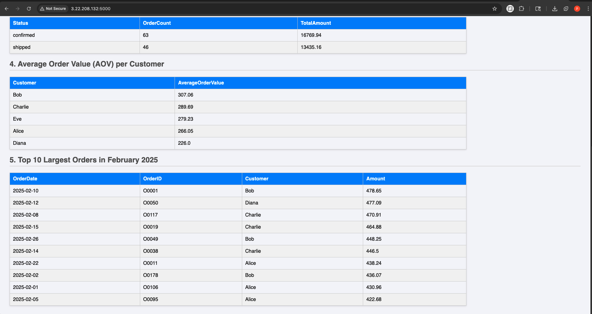

# Assignment 3: AWS Core Services

**Name: Thejas Prabakaran** 

**Student ID: 8014149982** 

## Approach and Implementation

The project adopts a serverless architecture to design and implement an end-to-end data processing pipeline on Amazon Web Services (AWS). The primary objective is to automate the ingestion, processing, cataloging, and visualization of data without relying on traditional server-based infrastructure, thereby enhancing scalability, cost efficiency, and maintainability.

The approach begins with data ingestion. Raw data files are uploaded into an Amazon S3 bucket, which serves as the central data lake for storing unprocessed information. The ingestion process is event-driven — whenever a new file is added to S3, an AWS Lambda function is automatically triggered. This function performs data transformation and cleaning, ensuring that the incoming data is structured, validated, and ready for downstream analytics. The use of Lambda eliminates the need for dedicated servers while allowing flexible scaling based on data volume.

Once the data is processed, it is registered and organized within the AWS Glue Data Catalog, which acts as a centralized metadata repository. Glue automatically crawls the processed data to infer schema definitions and make the data queryable using Amazon Athena. This enables seamless integration between the storage and query layers of the pipeline, allowing data analysts to perform SQL-based analysis directly over S3-stored datasets.

To present the processed insights, the results are made accessible through a dynamic web interface. This front-end application, hosted on an Amazon EC2 instance, retrieves query outputs from Athena and visualizes them in an interactive format. The EC2-hosted webpage provides users with a simple dashboard for monitoring key metrics and exploring the processed data in real time.

Overall, the implementation showcases a modular, event-driven architecture where each AWS service plays a distinct role within the pipeline. The design not only demonstrates the effectiveness of serverless computing for data workflows but also highlights best practices in automation, scalability, and cost optimization within the AWS ecosystem.

## Setup and Execution

## 1. Amazon S3 Bucket Structure 🪣

First, set up an S3 bucket with the following folder structure to manage the data workflow:

* **`bucket-name/`**
    * **`raw/`**: For incoming raw data files.
    * **`processed/`**: For cleaned and filtered data output by the Lambda function.
    * **`enriched/`**: For storing athena query results.

---

## 2. IAM Roles and Permissions 🔐

Create the following IAM roles to grant AWS services the necessary permissions to interact with each other securely.

### Lambda Execution Role

1.  Navigate to **IAM** -> **Roles** and click **Create role**.
2.  **Trusted entity type**: Select **AWS service**.
3.  **Use case**: Select **Lambda**.
4.  **Add Permissions**: Attach the following managed policies:
    * `AWSLambdaBasicExecutionRole`
    * `AmazonS3FullAccess`
5.  Give the role a descriptive name (e.g., `Lambda-S3-Processing-Role`) and create it.

### Glue Service Role

1.  Create another IAM role for **AWS service** with the use case **Glue**.
2.  **Add Permissions**: Attach the following policies:
    * `AmazonS3FullAccess`
    * `AWSGlueConsoleFullAccess`
    * `AWSGlueServiceRole`
3.  Name the role (e.g., `Glue-S3-Crawler-Role`) and create it.

### EC2 Instance Profile

1.  Create a final IAM role for **AWS service** with the use case **EC2**.
2.  **Add Permissions**: Attach the following policies:
    * `AmazonS3FullAccess`
    * `AmazonAthenaFullAccess`
3.  Name the role (e.g., `EC2-Athena-Dashboard-Role`) and create it.

---

## 3. Create the Lambda Function ⚙️

This function will automatically process files uploaded to the `raw/` S3 folder.

1.  Navigate to the **Lambda** service in the AWS Console.
2.  Click **Create function**.
3.  Select **Author from scratch**.
4.  **Function name**: `FilterAndProcessOrders`
5.  **Runtime**: Select **Python 3.9** (or a newer version).
6.  **Permissions**: Expand *Change default execution role*, select **Use an existing role**, and choose the **Lambda Execution Role** you created.
7.  Click **Create function**.
8.  In the **Code source** editor, replace the default code with LambdaFunction.py code for processing the raw data.

---

## 4. Configure the S3 Trigger ⚡

Set up the S3 trigger to invoke your Lambda function automatically.

1.  In the Lambda function overview, click **+ Add trigger**.
2.  **Source**: Choose **S3**.
3.  **Bucket**: Select your S3 bucket.
4.  **Event types**: Choose **All object create events**.
5.  **Prefix (Required)**: Enter `raw/`. This ensures the function only triggers for files in this folder.
6.  **Suffix (Recommended)**: Enter `.csv`.
7.  Check the acknowledgment box and click **Add**.

--- 
**Start Processing of Raw Data**: Now upload the Orders.csv file into the `raw/` folder of the S3 Bucket. This will automatically trigger the Lambda function.
---

## 5. Create a Glue Crawler 🕸️

The crawler will scan your processed data and create a data catalog, making it queryable by Athena.

1.  Navigate to the **AWS Glue** service.
2.  In the left pane, select **Crawlers** and click **Create crawler**.
3.  **Name**: `orders_processed_crawler`.
4.  **Data source**: Point the crawler to the `processed/` folder in your S3 bucket.
5.  **IAM Role**: Select the **Glue Service Role** you created earlier.
6.  **Output**: Click **Add database** and create a new database named `orders_db`.
7.  Finish the setup and run the crawler. It will create a new table in your `orders_db` database.

---

## 6. Query Data with Amazon Athena 🔍

Navigate to the **Athena** service. Ensure your data source is set to `AwsDataCatalog` and the database is `orders_db`. You can now run SQL queries on your processed data.

**Queries to be executed:**
* **Total Sales by Customer**: Calculate the total amount spent by each customer.
* **Monthly Order Volume and Revenue**: Aggregate the number of orders and total revenue per month.
* **Order Status Dashboard**: Summarize orders based on their status (`shipped` vs. `confirmed`).
* **Average Order Value (AOV) per Customer**: Find the average amount spent per order for each customer.
* **Top 10 Largest Orders in February 2025**: Retrieve the highest-value orders from a specific month.

---

## 7. Launch the EC2 Web Server 🖥️

This instance will host a simple web page to display the Athena query results.

1.  Navigate to the **EC2** service and click **Launch instance**.
2.  **Name**: `Athena-Dashboard-Server`.
3.  **Application and OS Images**: Select **Amazon Linux 2023 AMI**.
4.  **Instance type**: Choose **t2.micro** (Free tier eligible).
5.  **Key pair (login)**: Create and download a new key pair. **Save the `.pem` file!**
6.  **Network settings**: Click **Edit** and configure the security group:
    * **Rule 1 (SSH)**: Type: `SSH`, Port: `22`, Source: `My IP`.
    * **Rule 2 (Web App)**: Click **Add security group rule**.
        * Type: `Custom TCP`
        * Port Range: `5000`
        * Source: `Anywhere` (`0.0.0.0/0`)
7.  **Advanced details**: Scroll down and for **IAM instance profile**, select the **EC2 Instance Profile** you created.
8.  Click **Launch instance**.

---

## 8. Connect to Your EC2 Instance

1.  From the EC2 dashboard, select your instance and copy its **Public IPv4 address**.
2.  Open a terminal or SSH client and connect using your key pair:

    ```bash
    ssh -i /path/to/your-key-file.pem ec2-user@YOUR_PUBLIC_IP_ADDRESS
    ```

---

## 9. Set Up the Web Environment

Once connected via SSH, run the following commands to install the necessary software.

1.  **Update system packages**:
    ```bash
    sudo yum update -y
    ```
2.  **Install Python and Pip**:
    ```bash
    sudo yum install python3-pip -y
    ```
3.  **Install Python libraries (Flask & Boto3)**:
    ```bash
    pip3 install Flask boto3
    ```

---

## 10. Create and Configure the Web Application

1.  Create the application file using the `nano` text editor:
    ```bash
    nano app.py
    ```
2.  Copy and paste your Python web application code (`EC2InstanceNANOapp.py`) into the editor.

3.  ‼️ **Important**: Update the placeholder variables at the top of the script:
    * `AWS_REGION`: Your AWS region (e.g., `us-east-1`).
    * `ATHENA_DATABASE`: The name of your Glue database (e.g., `orders_db`).
    * `S3_OUTPUT_LOCATION`: The S3 URI for your Athena query results (e.g., `s3://your-athena-results-bucket/`).

4.  Save the file and exit `nano` by pressing `Ctrl + X`, then `Y`, then `Enter`.

---

## 11. Run the App and View Your Dashboard! 🚀

1.  Execute the Python script to start the web server:
    ```bash
    python3 app.py
    ```
    You should see a message like `* Running on http://0.0.0.0:5000/`.

2.  Open a web browser and navigate to your instance's public IP address on port 5000:
    ```
    http://YOUR_PUBLIC_IP_ADDRESS:5000
    ```
    You should now see your Athena Orders Dashboard!

## Screenshots

1. Amazon S3 Bucket Structure screenshot:


2. IAM roles created


3. Lambda Function


4. Lambda Trigger


5. Crawler


6. Processed CSV file in Processed Folder in S3


7. Crawler logs in CloudWatch


8. Athena query CSV files in teh S3 enriched folder


9. Final webpage - Dashboard Screenshots



## Challenges and Solutions

1. The first issue I got was there was mismatch in the name of the table in the query so while executing the queries I got the error saying that tables does not exist and that time i just gave the correct table name processed and I got the correct results.

2. Second issue was while trying to access the ec2 instance using terminal I had to give some permission for the key value .pm files for it to work

3. So similarly I forgot to change the table name in the app.py file so initally I got the error saying the table was not found so the dashboard no results were visible, then I had to change the table name and it worked.
